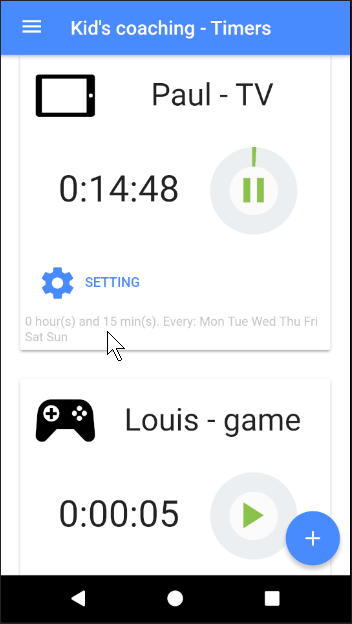
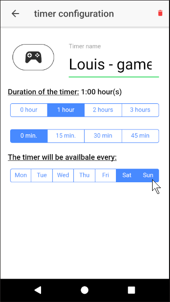
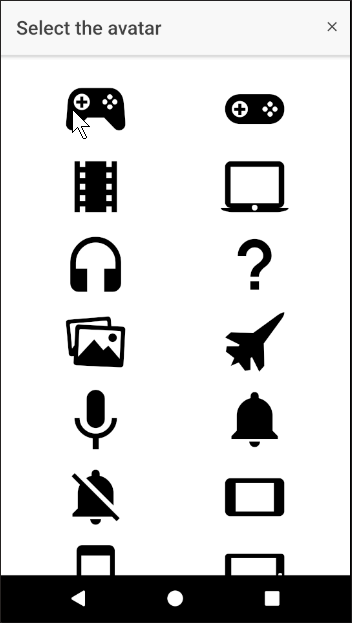

# KCT - Kids Coaching Timers

> This project is a personal project in order to learn some technologies and technics. This project is not finalized, it should envolve to add new features and/or try new technos or technics. Do not hesitate to participate or fork the project.

KCT is made to help managing the duration of distractions (games, tv, ...) of our kids. The purpose is to define with our kids distractions duration for certain days of the week, define duration as timers in the app, start the timers when they start playing and the timer will alert you when duration is over.

In the application:

1. You define the duration (timers) of distraction for your kids (e.g.: 1 hour)
1. You define which days of the week the timers are available ( e.g.: during week-end 'saturday', 'sunday')
1. When the kid is playing start the timer ( i.e.: this is to force them being "responsible")
1. The timer may be "paused" and "restarted"
1. At the end annoying sound is played to alert everybody of the end of the timer
1. Everyday, timers are reinitialized and evaluated if there accessible based on the configuration

Remarks:

* You can define as many timers as you care (e.g.: games, tv, computer, ...)
* Several timers may run in parallel

## Screens

### List of timers

### Define timer

### Select an icon per timer

## Features backlog

Apart several bugs remaining, here are some features that I would like to see in this program, your help is welcome!

* define a passcode to modify the timers configuration
* synchronize phones when timer is started / running
* localisation of the app
* history of timers executed over weeks
